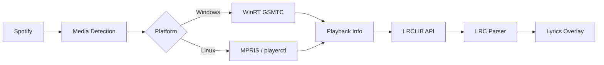

# LyricScript

A lightweight desktop lyrics overlay for **Spotify**. LyricScript detects what you're playing, fetches synchronized lyrics from [LRCLIB](https://lrclib.net), and displays them in a frameless, always-on-top widget that sits over your desktop or games.

Built with **Python** and **PyQt6**.

---

## Features

- **Synchronized lyrics** — LRC timestamp parsing with smooth line transitions and configurable context lines (previous/upcoming)
- **Spotify integration** — Works with Spotify Desktop and web players (Brave, Chrome, Edge, Firefox, Opera)
- **Cross-platform playback detection**
  - **Windows:** Global System Media Transport Controls (GSMTC) via WinRT, with window-title fallback
  - **Linux:** MPRIS over D-Bus (`dbus-python`, Gio, or `playerctl`)
- **System tray app** — Runs in the background; control everything from the tray icon
- **Fully customizable UI** — Fonts, colors, alignment, drop shadow, background opacity, and built-in theme presets
- **Sync offset nudge** — Fine-tune lyric timing when lyrics are slightly early or late
- **Smart lyrics lookup** — Exact match, fuzzy search, and cleaned-title fallbacks via LRCLIB; disk + in-memory caching
- **Live diagnostic logs** — Built-in console for troubleshooting media detection and lyric fetching

---

## Screenshots

> Add screenshots of the overlay and settings dialog here.

---

## Requirements

| Platform | Requirements |
|----------|--------------|
| **All** | Python 3.10+, Spotify (desktop or web) |
| **Windows** | Windows 10/11 recommended; optional [`pywin32`](https://pypi.org/project/pywin32/) for window-title fallback |
| **Linux** | Spotify with MPRIS support; `dbus-python`, `python3-gi`, or `playerctl` |

---

## Installation

### 1. Clone the repository

```bash
git clone https://github.com/YOUR_USERNAME/LyricScript.git
cd LyricScript
```

### 2. Create a virtual environment (recommended)

```bash
python -m venv venv

# Windows
venv\Scripts\activate

# Linux / macOS
source venv/bin/activate
```

### 3. Install dependencies

```bash
pip install -r requirements.txt
```

**Windows (optional, for fallback media detection):**

```bash
pip install pywin32
```

**Linux (if not using `playerctl`):**

```bash
# Debian / Ubuntu
sudo apt install python3-dbus python3-gi

# Or install playerctl as a fallback
sudo apt install playerctl
```

### 4. Run LyricScript

```bash
python main.py
```

The app starts in the **system tray**. Right-click the music-note icon near the clock to open settings, toggle the overlay, or exit.

---

## Usage

1. **Start Spotify** — Play any track in the desktop app or a web browser.
2. **LyricScript auto-detects** the active session and fetches synced lyrics.
3. **Drag** the overlay to reposition it; **resize** from the bottom-right corner.
4. **Right-click** the overlay or tray icon for quick actions.

### System tray menu

| Action | Description |
|--------|-------------|
| **Settings** | Open the customization dialog |
| **Target Media Source** | Pick a specific app/session (e.g. Brave vs Spotify Desktop) |
| **Hide / Show Lyrics Overlay** | Toggle widget visibility |
| **Always on Top** | Keep the overlay above other windows |
| **Lock Position** | Disable drag-to-move |
| **Exit** | Quit the application |

### Keyboard shortcuts

| Shortcut | Action |
|----------|--------|
| `Ctrl+Shift+L` | Toggle overlay visibility |
| `Ctrl+Left` | Nudge sync timing **−250 ms** (lyrics appear earlier) |
| `Ctrl+Right` | Nudge sync timing **+250 ms** (lyrics appear later) |

---

## Settings

Open **Settings** from the tray to customize:

- **Typography** — Font family, size, bold, alignment, song info sub-label
- **Appearance** — Text/background/shadow colors, opacity, blur
- **Behavior & Source** — Media source, always-on-top, lock position, multi-line context, sync offset
- **Theme presets** — Default Clean, Cinematic Dark, Neon Glow, High Contrast
- **Live Logs** — Real-time diagnostic output

Settings are saved to `settings.json` in the project directory.

---

## Project structure

```
LyricScript/
├── main.py              # Application entry point
├── lyrics_widget.py     # Main overlay UI, tray icon, lyric display loop
├── spotify_player.py    # Playback detection (WinRT / MPRIS / playerctl)
├── lrclib_client.py     # LRCLIB API client with disk caching
├── lrc_parser.py        # LRC format parser (bisect-based lookup)
├── settings_manager.py  # Persistent settings (JSON)
├── settings_dialog.py   # Settings UI with live preview
├── logger.py            # Thread-safe logging with live log viewer
├── settings.json        # User settings (created on first run)
├── requirements.txt     # Python dependencies
└── .lyrics_cache/       # Cached lyrics (auto-created)
```

---

## How it works



1. A background worker polls the active media session (~12.5 Hz on Windows).
2. On track change, lyrics are fetched asynchronously from LRCLIB (exact match → fuzzy search → cleaned-title fallback).
3. The overlay updates every 50 ms, matching the current playback position to LRC timestamps.

---

## Troubleshooting

### "Waiting for Spotify..."

- Make sure Spotify is playing (not just open).
- On **Windows**, try selecting the correct **Target Media Source** in Settings or the tray menu.
- If using Spotify Desktop and metadata is missing, enable **Show desktop overlay** in Spotify → Settings → Display.

### Lyrics are out of sync

- Use `Ctrl+Left` / `Ctrl+Right` to nudge timing, or adjust **Sync Offset** in Settings.
- Web players may report less accurate playback position than the desktop app.

### No synced lyrics found

- Not every song is in LRCLIB. Plain (unsynced) lyrics may be shown as a fallback.
- Check the **Live Logs** tab in Settings for lookup details.

### Window-title fallback not working (Windows)

Install the optional dependency:

```bash
pip install pywin32
```

---

## Lyrics data

Lyrics are provided by the community-driven [LRCLIB](https://lrclib.net) API. LyricScript caches responses locally in `.lyrics_cache/` to reduce network requests.

---

## License

No license file is included yet. Add one before publishing if you plan to open-source this project.

---

## Acknowledgments

- [LRCLIB](https://lrclib.net) — Synced lyrics API
- [PyQt6](https://www.riverbankcomputing.com/software/pyqt/) — Desktop UI framework
